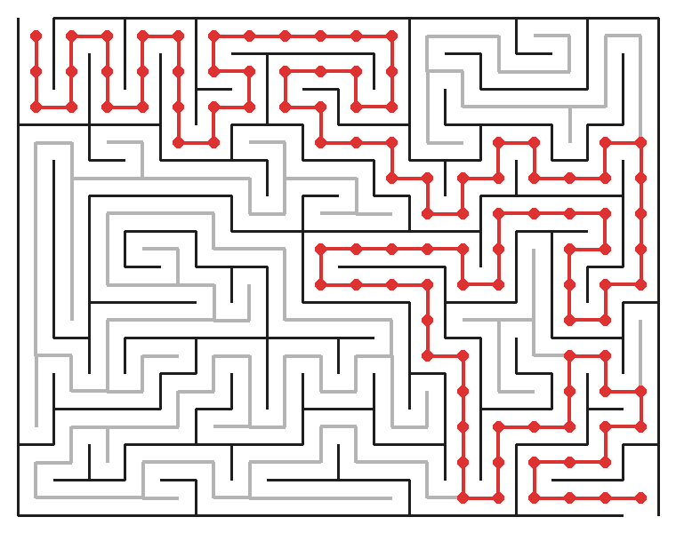

Maze Solver with Python
=======================

| **Source:** `github.com/sirtaylor88/maze-solver-with-python <https://github.com/sirtaylor88/maze-solver-with-python>`_
| **Releases:** `github.com/…/releases <https://github.com/sirtaylor88/maze-solver-with-python/releases>`_

A maze generator and solver built with Python and
`tkinter <https://docs.python.org/3/library/tkinter.html>`_.

Mazes are generated with **randomised recursive backtracking** and solved with
**depth-first search**, visualised in real time inside a tkinter window.

.. toctree::
   :maxdepth: 2
   :caption: Contents

   usage
   development
   api

----

How it works
------------

The grid is stored as a column-major 2-D list of
:class:`~maze_solver_with_python.core.models.Cell` objects: ``_cells[col][row]``,
where *col* is the x-axis index and *row* is the y-axis index.

.. list-table::
   :header-rows: 1
   :widths: 20 40 40

   * - Phase
     - Algorithm
     - Entry point
   * - Generation
     - `Randomised recursive backtracking
       <https://en.wikipedia.org/wiki/Maze_generation_algorithm#Randomized_depth-first_search>`_ (DFS)
     - :meth:`~maze_solver_with_python.core.models.Maze._break_walls_r`
   * - Solving
     - `Depth-first search <https://en.wikipedia.org/wiki/Depth-first_search>`_
     - :meth:`~maze_solver_with_python.core.models.Maze.solve`

- **Entrance** — top wall of ``_cells[0][0]``
- **Exit** — bottom wall of ``_cells[-1][-1]``
- Pass a ``seed`` to :class:`~maze_solver_with_python.core.models.Maze` for
  reproducible layouts.
- Pass ``win=None`` to run headlessly (no display required — used in tests).

----

Indices and tables
------------------

* :ref:`genindex`
* :ref:`modindex`
